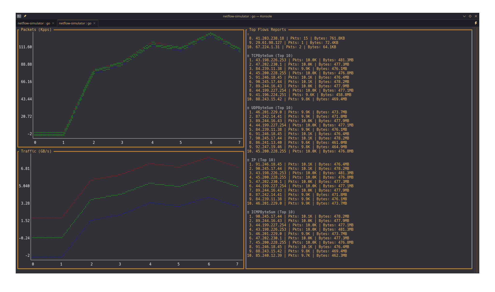

##  Netflow simulator

simulate a work flow processor that:

- receives millions of network packets
- aggregate them by IP and protocol
- save history of them
- and show their changes through time

current dashboards:

- Packet charts per protocol
- Traffic(GB) charts per protocol
- Top 10 Packets base on differnet filters

v1 image:

